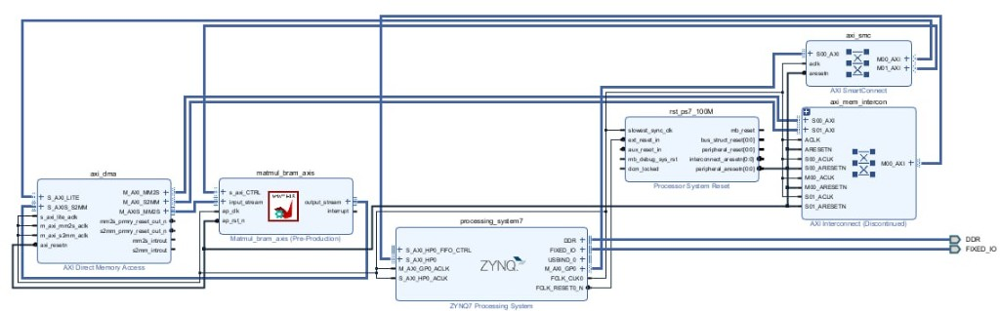
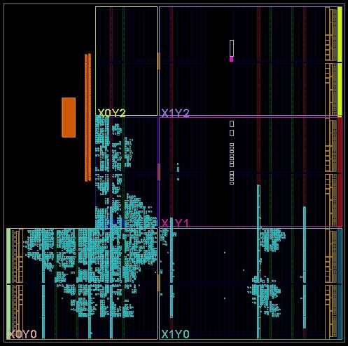

# CPU vs FPGA: Matrix Multiplication Comparison

This repository documents a comparative study of **dense \(N \times N\) integer matrix multiplication** across three execution environments:

**Authors:** Sepehr Farrokhi, Amin Javan, Armin Siavashi (report: *FPGA vs CPU*).

1. **ARM CPU** — the processing system on a Xilinx Zynq SoC (e.g. PYNQ), running software-only matmul.
2. **FPGA accelerator** — the same SoC’s programmable logic, running a custom **HLS** core (`matmul_bram_axis`) fed by **AXI DMA** from DDR.
3. **Intel x86 CPU** — a desktop or laptop class processor running an optimized software baseline (per your report; see `host/` for reference scripts).

## Repository layout

```
CPU-Vs-FPGA-1/
├── README.md
├── LICENSE
├── host/                           # Python scripts for the Intel/desktop CPU baseline
│   ├── hello.py
│   └── matmul.py
├── fpga/
│   ├── hls/                        # C/C++ sources for Vivado HLS / Vitis HLS
│   │   ├── matmul/
│   │   │   ├── matmul_bram_axis.cpp
│   │   │   └── tb_matmul_bram_axis.cpp
│   │   └── matmul_parallel/
│   │       └── matmul_parallel.cpp
│   └── pynq/                       # Jupyter flows + `.hwh` handoff files (deploy alongside your `.bit`)
│       ├── hello/
│       ├── matmul/
│       └── matmul_parallel/
├── notebooks/
│   └── host_cpu_runner.ipynb       # Runs every script in host/ and writes results/ JSON
├── docs/
│   └── images/                     # Figures for this README (Vivado block design, floorplan)
└── results/                        # Generated by notebooks (gitignored)
```

## Goal

We want to **measure end-to-end execution time** as \(N\) grows and to **quantify when custom hardware pays off**. Matrix multiply is \(\mathcal{O}(N^3)\); the ARM core on the board is much weaker than a modern Intel CPU for scalar code, while the FPGA design can exploit **parallelism, pipelining, and streaming I/O** to hide part of that cost. The experiment answers:

- At which \(N\) does the FPGA beat the **on-board ARM** implementation?
- How does the **FPGA overlay** compare to a **fast x86** baseline across the same problem sizes?

Correctness checks (`OK=True` on FPGA runs) confirm the accelerator output matches the reference implementation.

## FPGA implementation (from HLS)

The `matmul_bram_axis` kernel streams **A** and **B** over AXI-Stream, stores them in **on-chip BRAM**, and streams **C** out. Matrices are `size × size` with `size ≤ MAX_N` (**256** in the reference design). Element type is **`ap_int<16>`** for **A** and **B**; accumulators / **C** use **`ap_int<32>`**. Arrays **A** and **B** use **cyclic partitioning** with **`PAR_FACTOR` 16** so the inner multiply-accumulate can issue many partial products in parallel.

**Tool flow:** Vitis HLS (C/C++ testbench + `matmul_bram_axis.cpp`) → packaged IP → Vivado block design (Zynq-7 PS, **AXI DMA**, interconnect) → synthesis, place & route, bitstream.

## Hardware / software architecture (FPGA path)

The Vivado IP integrator connects the Zynq **processing_system7**, an **axi_dma** (MM2S / S2MM), and **SmartConnect / Interconnect** fabric to the `matmul_bram_axis` core: the CPU configures the accelerator and DMA via **AXI-Lite**; matrices move between DDR and the core over **high-performance AXI** and **AXIS** streams.

| Block diagram (PS + DMA + accelerator) | Device floorplan after place & route |
| :---: | :---: |
|  |  |

The floorplan screenshot uses Vivado region labels (**X0Y0**, …) on the silicon grid: dense cyan regions are **accelerator logic** (and related routing); **BRAM tiles** hold **A** and **B**; unused area is spare fabric.

### Target device, timing, and utilization

Post-placement results on **Xilinx xc7z020clg400-1** (Zynq-7020), **100 MHz** clock:

| Resource | Used | Available | Utilization |
|----------|-----:|----------:|------------:|
| Block RAM (RAMB36) | 66 | 140 | **47%** |
| Slice LUTs | 4,469 | 53,200 | 8.4% |
| Flip-flops | 5,446 | 106,400 | 5.1% |
| DSP48E1 | 16 | 220 | 7.3% |

**Timing:** critical path **~6.92 ns** (design meets timing with **~3.08 ns** slack at the reported clock). BRAM is the main consumer of area; the design fits comfortably in this part.

Relevant sources in this repo:

- **FPGA kernels (HLS):** `fpga/hls/matmul/matmul_bram_axis.cpp`, `fpga/hls/matmul_parallel/matmul_parallel.cpp`
- **PYNQ notebooks + handoff:** `fpga/pynq/matmul/test_pynq.ipynb`, `fpga/pynq/matmul_parallel/test_pynq.ipynb`, `fpga/pynq/hello/test_pynq.ipynb` (each folder holds the matching `.hwh`; copy the Vivado-produced `.bit` here before running on the board)
- **Intel desktop scripts:** `host/`
- **Batch host runner notebook:** `notebooks/host_cpu_runner.ipynb`

## Results (from your report)

**Primary comparison:** **FPGA vs ARM Cortex-A9** on the **same Zynq chip** (fair power and platform context). The **Intel laptop** numbers are **reference only** (different machine, highly optimized scalar/vector Python/BLAS-style math).

Times are **milliseconds** unless noted. FPGA **speedup** is relative to **ARM CPU** (\(T_{\mathrm{ARM}} / T_{\mathrm{FPGA}}\)).

| Observation | |
|---|---|
| **\(N=32\)** | ARM wins; FPGA pays **DMA/controller setup** and transfer overhead. |
| **\(N \approx 64\)** | **Crossover** where FPGA overtakes ARM. |
| **Larger \(N\)** | **Parallelism dominates**; ARM runtime grows sharply (stress on memory hierarchy / cache misses at scale). |
| **\(N=1024\)** | ARM ~**3 minutes** vs FPGA ~**2.2 s** in these runs. |
| **\(N=2048\)** | ARM ~**24 minutes** vs FPGA ~**17.4 s**; speedup tops out near **84×**. |

### ARM CPU (Zynq PS)

| \(N\) | Time (ms) |
|------:|----------:|
| 32 | 0.503 |
| 64 | 4.183 |
| 128 | 53.553 |
| 256 | 489.003 |
| 512 | 11580.654 |
| 1024 | 177452.201 |
| 2048 | 1456267.704 |

### FPGA accelerator

| \(N\) | OK | Time (ms) | Speedup vs ARM |
|------:|:--:|----------:|---------------:|
| 32 | ✓ | 2.663 | 0.19× |
| 64 | ✓ | 3.537 | 1.18× |
| 128 | ✓ | 7.037 | 7.61× |
| 256 | ✓ | 18.769 | 26.05× |
| 512 | ✓ | 290.581 | 39.85× |
| 1024 | ✓ | 2223.876 | 79.79× |
| 2048 | ✓ | 17395.936 | 83.71× |

### Intel x86 CPU

| \(N\) | Avg (ms) | Median (ms) |
|------:|---------:|------------:|
| 32 | 0.024 | 0.023 |
| 64 | 0.149 | 0.145 |
| 128 | 1.344 | 1.284 |
| 256 | 10.089 | 10.063 |
| 512 | 170.916 | 169.065 |
| 1024 | 2513.741 | 2486.709 |
| 2048 | 66140.140 | 66305.848 |

### How to read the numbers

- For **small \(N\)**, **DMA and control-path overhead** dominate; the FPGA is **slower than the on-board ARM** at \(N=32\) in this dataset.
- Near **\(N \approx 64\)**, FPGA time crosses roughly even with ARM, then pulls away as \(N\) increases.
- At **\(N=2048\)**, the FPGA is **~84× faster** than the ARM software path on the same board—showing why accelerators matter for compute-bound kernels at scale.
- Versus **Intel**, the FPGA is slower at small/medium \(N\) in these measurements but becomes **competitive or faster at large \(N\)** (e.g. FPGA ~17.4 s vs Intel average ~66.1 s at 2048), which matches the intuition that offload wins when arithmetic dominates transfer and control overhead.

### Trade-offs (summary from the report)

| Dimension | ARM Cortex-A9 | FPGA matmul IP |
|-----------|----------------|----------------|
| **Speed (large \(N\))** | Scalar-centric, runtime grows steeply | Dedicated datapath (e.g. **16-wide** partial parallelism); up to **~84×** vs ARM here |
| **Small matrices** | Lower overhead | Setup / DMA cost hurts |
| **Development** | Minutes (e.g. Python) | Days (HLS + Vivado integration) |
| **Flexibility** | Change code immediately | Algorithm changes need re-synthesis |
| **Power** | Full PS active for software path | Vivado **post-route power** on **xc7z020** shows **much lower** consumption for the routed accelerator path than driving the same work on ARM in the report (**~14×** in their analysis) |
| **Determinism** | OS jitter possible | Fixed-clock, structured execution |

**When an FPGA helps:** Large, repeated compute where **latency or energy** matter (edge inference, DSP, radar, closed-loop control).

**When to stay on ARM:** Exploratory or one-off work, tiny problem sizes, or algorithms that change often.

### Running things locally

- **Host Python:** from the repo root, `python host/matmul.py` (or open `notebooks/host_cpu_runner.ipynb`; the notebook searches upward for the folder that contains `host/`).
- **PYNQ:** on the board, use the notebooks under `fpga/pynq/.../` with working directory set to that folder so `Overlay("*.bit")` finds your bitstream next to the `.hwh`.

## License

See [LICENSE](LICENSE).
